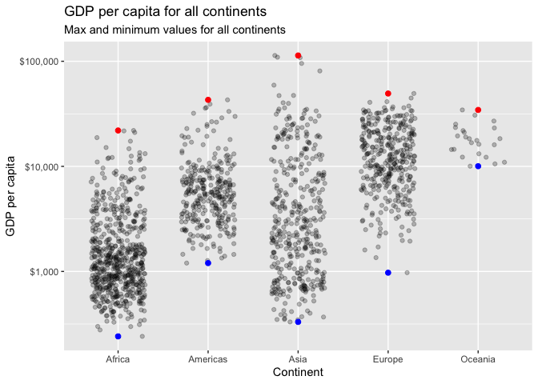
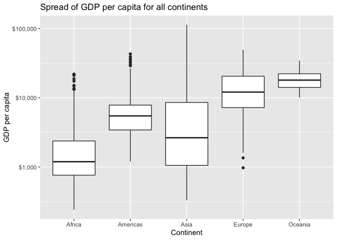
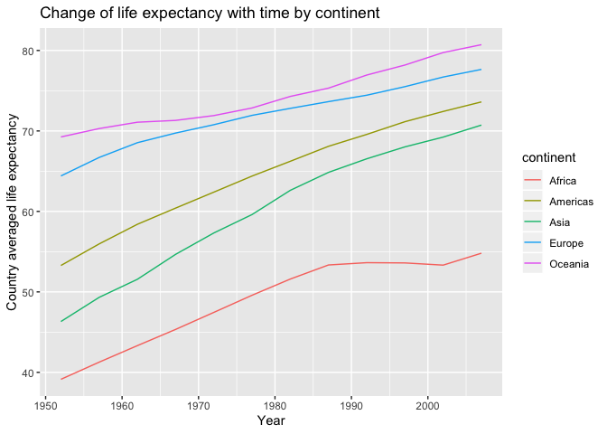

can change output to `github_document`


```r
library(tidyverse)
library(gapminder)
library(dplyr)
library(DT)
library(knitr)
```

# Instructions

Pick three of the six tasks below, and produce:

- a tibble, using dplyr as your data manipulation tool;
- an accompanying plot of data from the tibble, using ggplot2 as your visualization tool; and
- some dialogue about what your tables/figures show (doesn’t have to be much).

# Task Option 2
Get the maximum and minimum of GDP per capita for all continents.

## Tibble of GDP per capita for all continents

The following table shows the maximum and minimum GDP per capita for all continents in the gapminder dataset. 
This shows Africa has the lowest minimum GDP per capita and Asia has the highest GDP per capita. This can also be seen in the plot to follow. 


```r
gapminder %>% 
  group_by(continent) %>% 
  summarize(max_gdpPercap = max(gdpPercap),
            min_gdpPercap = min(gdpPercap)) %>% 
  knitr::kable()
```


continent    max_gdpPercap   min_gdpPercap
----------  --------------  --------------
Africa            21951.21        241.1659
Americas          42951.65       1201.6372
Asia             113523.13        331.0000
Europe            49357.19        973.5332
Oceania           34435.37      10039.5956

## Plot of GDP per capita for all continents

The following plot shows the data from the above table. The plot shows GDP per capita for all values in the original dataset but the highest and lowest GDP per capita for each continent are plotted in red and blue respectively. 


```r
gapminder %>% 
  ggplot(aes(x=continent, y= gdpPercap)) +
  geom_jitter(position = position_jitter(width = 0.3, height = 0), alpha = 1/4) +
  scale_y_log10(labels = scales::dollar_format()) +
  stat_summary(fun.y = min, colour = "blue", geom = "point", size = 2) +
  stat_summary(fun.y = max, colour = "red", geom = "point", size = 2)+
  labs(title = "GDP per capita for all continents", 
       x = "Continent", 
       y = "GDP per capita", 
       subtitle = "Max and minimum values for all continents")
```

<!-- -->

```r
# plotting min and max from this website:
# https://github.com/STAT545-UBC/Discussion/issues/133
```


# Task Option 3
Look at the spread of GDP per capita within the continents.

## Tibble of the spread of GDP per capita within the continents

The table below shows data for the spread of GDP per capita within the continents of the gapminder dataset. Here we have the mean (mu), the standard deviation (sigma), the maximum (max), the minimum (min), and the range of GDP per capita (range), which is max - min. This data is also visible in the following plot. 


```r
gapminder %>% 
  group_by(continent) %>% 
  summarize(mu = mean(gdpPercap),
            sigma = sd(gdpPercap),
            range = diff(range(gdpPercap)),
            max = max(gdpPercap),
            min = min(gdpPercap)) %>% 
  knitr::kable()
```


continent           mu       sigma       range         max          min
----------  ----------  ----------  ----------  ----------  -----------
Africa        2193.755    2827.930    21710.05    21951.21     241.1659
Americas      7136.110    6396.764    41750.02    42951.65    1201.6372
Asia          7902.150   14045.373   113192.13   113523.13     331.0000
Europe       14469.476    9355.213    48383.66    49357.19     973.5332
Oceania      18621.609    6358.983    24395.77    34435.37   10039.5956

## Plot of the spread of GDP per capita within the continents

The plot below shows the spread of GDP per capita within the continents of the gapminder dataset. This is a box plot. The box and tails show the range of the data for each continent. The interquartile ranges are also visible as the length of the box. The think horizontal line in the box is the mean of the data. And the maximum and minimum values are also clearly visible. 


```r
gapminder %>% 
  ggplot(aes(continent, gdpPercap)) +
  geom_boxplot() +
  scale_y_log10(labels = scales::dollar_format()) +
  labs(title = "Spread of GDP per capita for all continents", 
       x = "Continent", 
       y = "GDP per capita")
```

<!-- -->
  
  
  
# Task Option 5
How is life expectancy changing over time on different continents?

## Tibble of how life expectancy is changing over time on different continents

The table below shows the average life expectancy over all countries per year for each continent. The accompanying graph displays the change in life expectancy by year per continent.


```r
gapminder %>% 
  group_by(continent, year) %>% 
  summarize(mu = mean(lifeExp)) %>% 
  DT::datatable()
```

<!--html_preserve--><div id="htmlwidget-14a8dba7f1354653233b" style="width:100%;height:auto;" class="datatables html-widget"></div>
<script type="application/json" data-for="htmlwidget-14a8dba7f1354653233b">{"x":{"filter":"none","data":[["1","2","3","4","5","6","7","8","9","10","11","12","13","14","15","16","17","18","19","20","21","22","23","24","25","26","27","28","29","30","31","32","33","34","35","36","37","38","39","40","41","42","43","44","45","46","47","48","49","50","51","52","53","54","55","56","57","58","59","60"],["Africa","Africa","Africa","Africa","Africa","Africa","Africa","Africa","Africa","Africa","Africa","Africa","Americas","Americas","Americas","Americas","Americas","Americas","Americas","Americas","Americas","Americas","Americas","Americas","Asia","Asia","Asia","Asia","Asia","Asia","Asia","Asia","Asia","Asia","Asia","Asia","Europe","Europe","Europe","Europe","Europe","Europe","Europe","Europe","Europe","Europe","Europe","Europe","Oceania","Oceania","Oceania","Oceania","Oceania","Oceania","Oceania","Oceania","Oceania","Oceania","Oceania","Oceania"],[1952,1957,1962,1967,1972,1977,1982,1987,1992,1997,2002,2007,1952,1957,1962,1967,1972,1977,1982,1987,1992,1997,2002,2007,1952,1957,1962,1967,1972,1977,1982,1987,1992,1997,2002,2007,1952,1957,1962,1967,1972,1977,1982,1987,1992,1997,2002,2007,1952,1957,1962,1967,1972,1977,1982,1987,1992,1997,2002,2007],[39.1355,41.2663461538462,43.3194423076923,45.3345384615385,47.4509423076923,49.5804230769231,51.5928653846154,53.3447884615385,53.6295769230769,53.5982692307692,53.3252307692308,54.8060384615385,53.27984,55.96028,58.39876,60.41092,62.39492,64.39156,66.22884,68.09072,69.56836,71.15048,72.42204,73.60812,46.3143939393939,49.3185442424242,51.563223030303,54.66364,57.3192690909091,59.6105563636364,62.6179393939394,64.8511818181818,66.5372121212121,68.0205151515152,69.2338787878788,70.7284848484849,64.4085,66.7030666666667,68.5392333333333,69.7376,70.7750333333333,71.9377666666667,72.8064,73.6421666666667,74.4401,75.5051666666667,76.7006,77.6486,69.255,70.295,71.085,71.31,71.91,72.855,74.29,75.32,76.945,78.19,79.74,80.7195]],"container":"<table class=\"display\">\n  <thead>\n    <tr>\n      <th> <\/th>\n      <th>continent<\/th>\n      <th>year<\/th>\n      <th>mu<\/th>\n    <\/tr>\n  <\/thead>\n<\/table>","options":{"columnDefs":[{"className":"dt-right","targets":[2,3]},{"orderable":false,"targets":0}],"order":[],"autoWidth":false,"orderClasses":false}},"evals":[],"jsHooks":[]}</script><!--/html_preserve-->

## Plot of how life expectancy is changing over time on different continents

The plot below shows the change over time in the country averaged life expectancy for all continents in the gapminder dataset. The plot shows that Oceania has a consistently higher averaged life expactancy than all the other continents, and that Africa's average life expectancy is lower than all the other continents. 


```r
gapminder %>% 
  group_by(continent, year) %>% 
  summarize(mu = mean(lifeExp)) %>% 
  ggplot(aes(x = year, y = mu))+
  geom_line(aes(group = continent, colour = continent)) +
  labs(title = "Change of life expectancy with time by continent", 
       x = "Year", 
       y = "Country averaged life expectancy")
```

<!-- -->
  


