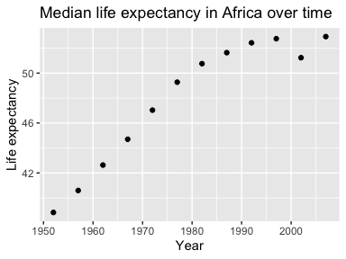

# Univariate data reshaping

**Option 2:**

## Compute life expectancy median for all possible combinations of continent and year. 

```r
median <- gapminder %>% 
  group_by(continent, year) %>% 
  summarize(median_lifeExp = median(lifeExp))

DT::datatable(median)
```

<!--html_preserve--><div id="htmlwidget-842f2a0acdf7b35c20b0" style="width:100%;height:auto;" class="datatables html-widget"></div>
<script type="application/json" data-for="htmlwidget-842f2a0acdf7b35c20b0">{"x":{"filter":"none","data":[["1","2","3","4","5","6","7","8","9","10","11","12","13","14","15","16","17","18","19","20","21","22","23","24","25","26","27","28","29","30","31","32","33","34","35","36","37","38","39","40","41","42","43","44","45","46","47","48","49","50","51","52","53","54","55","56","57","58","59","60"],["Africa","Africa","Africa","Africa","Africa","Africa","Africa","Africa","Africa","Africa","Africa","Africa","Americas","Americas","Americas","Americas","Americas","Americas","Americas","Americas","Americas","Americas","Americas","Americas","Asia","Asia","Asia","Asia","Asia","Asia","Asia","Asia","Asia","Asia","Asia","Asia","Europe","Europe","Europe","Europe","Europe","Europe","Europe","Europe","Europe","Europe","Europe","Europe","Oceania","Oceania","Oceania","Oceania","Oceania","Oceania","Oceania","Oceania","Oceania","Oceania","Oceania","Oceania"],[1952,1957,1962,1967,1972,1977,1982,1987,1992,1997,2002,2007,1952,1957,1962,1967,1972,1977,1982,1987,1992,1997,2002,2007,1952,1957,1962,1967,1972,1977,1982,1987,1992,1997,2002,2007,1952,1957,1962,1967,1972,1977,1982,1987,1992,1997,2002,2007,1952,1957,1962,1967,1972,1977,1982,1987,1992,1997,2002,2007],[38.833,40.5925,42.6305,44.6985,47.0315,49.2725,50.756,51.6395,52.429,52.759,51.2355,52.9265,54.745,56.074,58.299,60.523,63.441,66.353,67.405,69.498,69.862,72.146,72.047,72.899,44.869,48.284,49.325,53.655,56.95,60.765,63.739,66.295,68.69,70.265,71.028,72.396,65.9,67.65,69.525,70.61,70.885,72.335,73.49,74.815,75.451,76.116,77.5365,78.6085,69.255,70.295,71.085,71.31,71.91,72.855,74.29,75.32,76.945,78.19,79.74,80.7195]],"container":"<table class=\"display\">\n  <thead>\n    <tr>\n      <th> <\/th>\n      <th>continent<\/th>\n      <th>year<\/th>\n      <th>median_lifeExp<\/th>\n    <\/tr>\n  <\/thead>\n<\/table>","options":{"columnDefs":[{"className":"dt-right","targets":[2,3]},{"orderable":false,"targets":0}],"order":[],"autoWidth":false,"orderClasses":false}},"evals":[],"jsHooks":[]}</script><!--/html_preserve-->

## Take data and reshape to have one row per year and one variable for each continent.

```r
reshaped <- median %>% 
  pivot_wider(id_cols = year,
              names_from = continent,
              values_from = median_lifeExp)

DT::datatable(reshaped)
```

<!--html_preserve--><div id="htmlwidget-c4532e3db99881a94c35" style="width:100%;height:auto;" class="datatables html-widget"></div>
<script type="application/json" data-for="htmlwidget-c4532e3db99881a94c35">{"x":{"filter":"none","data":[["1","2","3","4","5","6","7","8","9","10","11","12"],[1952,1957,1962,1967,1972,1977,1982,1987,1992,1997,2002,2007],[38.833,40.5925,42.6305,44.6985,47.0315,49.2725,50.756,51.6395,52.429,52.759,51.2355,52.9265],[54.745,56.074,58.299,60.523,63.441,66.353,67.405,69.498,69.862,72.146,72.047,72.899],[44.869,48.284,49.325,53.655,56.95,60.765,63.739,66.295,68.69,70.265,71.028,72.396],[65.9,67.65,69.525,70.61,70.885,72.335,73.49,74.815,75.451,76.116,77.5365,78.6085],[69.255,70.295,71.085,71.31,71.91,72.855,74.29,75.32,76.945,78.19,79.74,80.7195]],"container":"<table class=\"display\">\n  <thead>\n    <tr>\n      <th> <\/th>\n      <th>year<\/th>\n      <th>Africa<\/th>\n      <th>Americas<\/th>\n      <th>Asia<\/th>\n      <th>Europe<\/th>\n      <th>Oceania<\/th>\n    <\/tr>\n  <\/thead>\n<\/table>","options":{"columnDefs":[{"className":"dt-right","targets":[1,2,3,4,5,6]},{"orderable":false,"targets":0}],"order":[],"autoWidth":false,"orderClasses":false}},"evals":[],"jsHooks":[]}</script><!--/html_preserve-->


## Make a plot with this data:

Plotting with data in this form isn't actually easier I found. It's easier to plot from the original data set. Unless plotting just for one country. 

```r
reshaped %>% 
  ggplot(aes(y = Africa, x = year ))+
  geom_point()+
  ggtitle("")+
  labs(title = "Median life expectancy in Africa over time", 
       x = "Year", 
       y = "Life expectancy") 
```



## Relengthen the data:

```r
back_to_norm <- reshaped %>% 
  pivot_longer(cols = -year,
              names_to = "continent",
              values_to = "Median_lifeExp")

DT::datatable(back_to_norm)
```

<!--html_preserve--><div id="htmlwidget-393db49e480b3e948477" style="width:100%;height:auto;" class="datatables html-widget"></div>
<script type="application/json" data-for="htmlwidget-393db49e480b3e948477">{"x":{"filter":"none","data":[["1","2","3","4","5","6","7","8","9","10","11","12","13","14","15","16","17","18","19","20","21","22","23","24","25","26","27","28","29","30","31","32","33","34","35","36","37","38","39","40","41","42","43","44","45","46","47","48","49","50","51","52","53","54","55","56","57","58","59","60"],[1952,1952,1952,1952,1952,1957,1957,1957,1957,1957,1962,1962,1962,1962,1962,1967,1967,1967,1967,1967,1972,1972,1972,1972,1972,1977,1977,1977,1977,1977,1982,1982,1982,1982,1982,1987,1987,1987,1987,1987,1992,1992,1992,1992,1992,1997,1997,1997,1997,1997,2002,2002,2002,2002,2002,2007,2007,2007,2007,2007],["Africa","Americas","Asia","Europe","Oceania","Africa","Americas","Asia","Europe","Oceania","Africa","Americas","Asia","Europe","Oceania","Africa","Americas","Asia","Europe","Oceania","Africa","Americas","Asia","Europe","Oceania","Africa","Americas","Asia","Europe","Oceania","Africa","Americas","Asia","Europe","Oceania","Africa","Americas","Asia","Europe","Oceania","Africa","Americas","Asia","Europe","Oceania","Africa","Americas","Asia","Europe","Oceania","Africa","Americas","Asia","Europe","Oceania","Africa","Americas","Asia","Europe","Oceania"],[38.833,54.745,44.869,65.9,69.255,40.5925,56.074,48.284,67.65,70.295,42.6305,58.299,49.325,69.525,71.085,44.6985,60.523,53.655,70.61,71.31,47.0315,63.441,56.95,70.885,71.91,49.2725,66.353,60.765,72.335,72.855,50.756,67.405,63.739,73.49,74.29,51.6395,69.498,66.295,74.815,75.32,52.429,69.862,68.69,75.451,76.945,52.759,72.146,70.265,76.116,78.19,51.2355,72.047,71.028,77.5365,79.74,52.9265,72.899,72.396,78.6085,80.7195]],"container":"<table class=\"display\">\n  <thead>\n    <tr>\n      <th> <\/th>\n      <th>year<\/th>\n      <th>continent<\/th>\n      <th>Median_lifeExp<\/th>\n    <\/tr>\n  <\/thead>\n<\/table>","options":{"columnDefs":[{"className":"dt-right","targets":[1,3]},{"orderable":false,"targets":0}],"order":[],"autoWidth":false,"orderClasses":false}},"evals":[],"jsHooks":[]}</script><!--/html_preserve-->


# Multivariate data reshaping

**Option 2:**

Compute some measure of life expectancy and GDP per capita (or two other numeric variables) (mean? median? min? max?) for all possible combinations of continent and year. Reshape that to have one row per year and one variable for each continent-measurement combination. Or the other way around: one row per continent and one variable for each year-measurement combination.
Re-lengthen the data.

## Compute the minimum life expectancy and GDP values per continent per year:

```r
minVar <- gapminder %>% 
  group_by(continent, year) %>% 
  summarize(minLifeExp = min(lifeExp),
            minGDP = min(gdpPercap))

DT::datatable(minVar)
```

<!--html_preserve--><div id="htmlwidget-526217281cf3cd6c55b9" style="width:100%;height:auto;" class="datatables html-widget"></div>
<script type="application/json" data-for="htmlwidget-526217281cf3cd6c55b9">{"x":{"filter":"none","data":[["1","2","3","4","5","6","7","8","9","10","11","12","13","14","15","16","17","18","19","20","21","22","23","24","25","26","27","28","29","30","31","32","33","34","35","36","37","38","39","40","41","42","43","44","45","46","47","48","49","50","51","52","53","54","55","56","57","58","59","60"],["Africa","Africa","Africa","Africa","Africa","Africa","Africa","Africa","Africa","Africa","Africa","Africa","Americas","Americas","Americas","Americas","Americas","Americas","Americas","Americas","Americas","Americas","Americas","Americas","Asia","Asia","Asia","Asia","Asia","Asia","Asia","Asia","Asia","Asia","Asia","Asia","Europe","Europe","Europe","Europe","Europe","Europe","Europe","Europe","Europe","Europe","Europe","Europe","Oceania","Oceania","Oceania","Oceania","Oceania","Oceania","Oceania","Oceania","Oceania","Oceania","Oceania","Oceania"],[1952,1957,1962,1967,1972,1977,1982,1987,1992,1997,2002,2007,1952,1957,1962,1967,1972,1977,1982,1987,1992,1997,2002,2007,1952,1957,1962,1967,1972,1977,1982,1987,1992,1997,2002,2007,1952,1957,1962,1967,1972,1977,1982,1987,1992,1997,2002,2007,1952,1957,1962,1967,1972,1977,1982,1987,1992,1997,2002,2007],[30,31.57,32.767,34.113,35.4,36.788,38.445,39.906,23.599,36.087,39.193,39.613,37.579,40.696,43.428,45.032,46.714,49.923,51.461,53.636,55.089,56.671,58.137,60.916,28.801,30.332,31.997,34.02,36.088,31.22,39.854,40.822,41.674,41.763,42.129,43.828,43.585,48.079,52.098,54.336,57.005,59.507,61.036,63.108,66.146,68.835,70.845,71.777,69.12,70.26,70.93,71.1,71.89,72.22,73.84,74.32,76.33,77.55,79.11,80.204],[298.8462121,335.9971151,355.2032273,412.9775136,464.0995039,502.3197334,462.2114149,389.8761846,410.8968239,312.188423,241.1658765,277.5518587,1397.717137,1544.402995,1662.137359,1452.057666,1654.456946,1874.298931,2011.159549,1823.015995,1456.309517,1341.726931,1270.364932,1201.637154,331,350,388,349,357,371,424,385,347,415,611,944,973.5331948,1353.989176,1709.683679,2172.352423,2860.16975,3528.481305,3630.880722,3738.932735,2497.437901,3193.054604,4604.211737,5937.029526,10039.59564,10949.64959,12217.22686,14463.91893,16046.03728,16233.7177,17632.4104,19007.19129,18363.32494,21050.41377,23189.80135,25185.00911]],"container":"<table class=\"display\">\n  <thead>\n    <tr>\n      <th> <\/th>\n      <th>continent<\/th>\n      <th>year<\/th>\n      <th>minLifeExp<\/th>\n      <th>minGDP<\/th>\n    <\/tr>\n  <\/thead>\n<\/table>","options":{"columnDefs":[{"className":"dt-right","targets":[2,3,4]},{"orderable":false,"targets":0}],"order":[],"autoWidth":false,"orderClasses":false}},"evals":[],"jsHooks":[]}</script><!--/html_preserve-->

## Reshape that to have one row per year and one variable for each continent-measurement combination:

```r
opt2Wide <- minVar %>% 
  pivot_wider(id_cols     = c(year), 
              names_from  = continent, 
              names_sep   = "_", 
              values_from = c(minLifeExp, minGDP))

DT::datatable(opt2Wide)
```

<!--html_preserve--><div id="htmlwidget-b1ccbfbf856896d43b86" style="width:100%;height:auto;" class="datatables html-widget"></div>
<script type="application/json" data-for="htmlwidget-b1ccbfbf856896d43b86">{"x":{"filter":"none","data":[["1","2","3","4","5","6","7","8","9","10","11","12"],[1952,1957,1962,1967,1972,1977,1982,1987,1992,1997,2002,2007],[30,31.57,32.767,34.113,35.4,36.788,38.445,39.906,23.599,36.087,39.193,39.613],[37.579,40.696,43.428,45.032,46.714,49.923,51.461,53.636,55.089,56.671,58.137,60.916],[28.801,30.332,31.997,34.02,36.088,31.22,39.854,40.822,41.674,41.763,42.129,43.828],[43.585,48.079,52.098,54.336,57.005,59.507,61.036,63.108,66.146,68.835,70.845,71.777],[69.12,70.26,70.93,71.1,71.89,72.22,73.84,74.32,76.33,77.55,79.11,80.204],[298.8462121,335.9971151,355.2032273,412.9775136,464.0995039,502.3197334,462.2114149,389.8761846,410.8968239,312.188423,241.1658765,277.5518587],[1397.717137,1544.402995,1662.137359,1452.057666,1654.456946,1874.298931,2011.159549,1823.015995,1456.309517,1341.726931,1270.364932,1201.637154],[331,350,388,349,357,371,424,385,347,415,611,944],[973.5331948,1353.989176,1709.683679,2172.352423,2860.16975,3528.481305,3630.880722,3738.932735,2497.437901,3193.054604,4604.211737,5937.029526],[10039.59564,10949.64959,12217.22686,14463.91893,16046.03728,16233.7177,17632.4104,19007.19129,18363.32494,21050.41377,23189.80135,25185.00911]],"container":"<table class=\"display\">\n  <thead>\n    <tr>\n      <th> <\/th>\n      <th>year<\/th>\n      <th>minLifeExp_Africa<\/th>\n      <th>minLifeExp_Americas<\/th>\n      <th>minLifeExp_Asia<\/th>\n      <th>minLifeExp_Europe<\/th>\n      <th>minLifeExp_Oceania<\/th>\n      <th>minGDP_Africa<\/th>\n      <th>minGDP_Americas<\/th>\n      <th>minGDP_Asia<\/th>\n      <th>minGDP_Europe<\/th>\n      <th>minGDP_Oceania<\/th>\n    <\/tr>\n  <\/thead>\n<\/table>","options":{"columnDefs":[{"className":"dt-right","targets":[1,2,3,4,5,6,7,8,9,10,11]},{"orderable":false,"targets":0}],"order":[],"autoWidth":false,"orderClasses":false}},"evals":[],"jsHooks":[]}</script><!--/html_preserve-->

## Re-lengthen the data:

```r
(opt2longer <- opt2Wide %>% 
  pivot_longer(cols      = c(-year), 
               names_to  = c(".value", "continent"),
               names_sep = "_") %>% 
   DT::datatable())
```

<!--html_preserve--><div id="htmlwidget-dbac42b8953710d29a53" style="width:100%;height:auto;" class="datatables html-widget"></div>
<script type="application/json" data-for="htmlwidget-dbac42b8953710d29a53">{"x":{"filter":"none","data":[["1","2","3","4","5","6","7","8","9","10","11","12","13","14","15","16","17","18","19","20","21","22","23","24","25","26","27","28","29","30","31","32","33","34","35","36","37","38","39","40","41","42","43","44","45","46","47","48","49","50","51","52","53","54","55","56","57","58","59","60"],[1952,1952,1952,1952,1952,1957,1957,1957,1957,1957,1962,1962,1962,1962,1962,1967,1967,1967,1967,1967,1972,1972,1972,1972,1972,1977,1977,1977,1977,1977,1982,1982,1982,1982,1982,1987,1987,1987,1987,1987,1992,1992,1992,1992,1992,1997,1997,1997,1997,1997,2002,2002,2002,2002,2002,2007,2007,2007,2007,2007],["Africa","Americas","Asia","Europe","Oceania","Africa","Americas","Asia","Europe","Oceania","Africa","Americas","Asia","Europe","Oceania","Africa","Americas","Asia","Europe","Oceania","Africa","Americas","Asia","Europe","Oceania","Africa","Americas","Asia","Europe","Oceania","Africa","Americas","Asia","Europe","Oceania","Africa","Americas","Asia","Europe","Oceania","Africa","Americas","Asia","Europe","Oceania","Africa","Americas","Asia","Europe","Oceania","Africa","Americas","Asia","Europe","Oceania","Africa","Americas","Asia","Europe","Oceania"],[30,37.579,28.801,43.585,69.12,31.57,40.696,30.332,48.079,70.26,32.767,43.428,31.997,52.098,70.93,34.113,45.032,34.02,54.336,71.1,35.4,46.714,36.088,57.005,71.89,36.788,49.923,31.22,59.507,72.22,38.445,51.461,39.854,61.036,73.84,39.906,53.636,40.822,63.108,74.32,23.599,55.089,41.674,66.146,76.33,36.087,56.671,41.763,68.835,77.55,39.193,58.137,42.129,70.845,79.11,39.613,60.916,43.828,71.777,80.204],[298.8462121,1397.717137,331,973.5331948,10039.59564,335.9971151,1544.402995,350,1353.989176,10949.64959,355.2032273,1662.137359,388,1709.683679,12217.22686,412.9775136,1452.057666,349,2172.352423,14463.91893,464.0995039,1654.456946,357,2860.16975,16046.03728,502.3197334,1874.298931,371,3528.481305,16233.7177,462.2114149,2011.159549,424,3630.880722,17632.4104,389.8761846,1823.015995,385,3738.932735,19007.19129,410.8968239,1456.309517,347,2497.437901,18363.32494,312.188423,1341.726931,415,3193.054604,21050.41377,241.1658765,1270.364932,611,4604.211737,23189.80135,277.5518587,1201.637154,944,5937.029526,25185.00911]],"container":"<table class=\"display\">\n  <thead>\n    <tr>\n      <th> <\/th>\n      <th>year<\/th>\n      <th>continent<\/th>\n      <th>minLifeExp<\/th>\n      <th>minGDP<\/th>\n    <\/tr>\n  <\/thead>\n<\/table>","options":{"columnDefs":[{"className":"dt-right","targets":[1,3,4]},{"orderable":false,"targets":0}],"order":[],"autoWidth":false,"orderClasses":false}},"evals":[],"jsHooks":[]}</script><!--/html_preserve-->

# Table joins


**Q3.1**

## For each guest in the guestlist (guest tibble), add a column for email address, which can be found in the email tibble.


```r
allEmail <- email %>% 
  separate_rows(guest, sep = ", ") %>% 
  rename(name = guest)

# needed the sep = "comma space"

newGuest <- guest %>% 
  left_join(allEmail, 
            by= "name")

DT::datatable(newGuest)
```

<!--html_preserve--><div id="htmlwidget-3296aa6f0fca1e7e9a5c" style="width:100%;height:auto;" class="datatables html-widget"></div>
<script type="application/json" data-for="htmlwidget-3296aa6f0fca1e7e9a5c">{"x":{"filter":"none","data":[["1","2","3","4","5","6","7","8","9","10","11","12","13","14","15","16","17","18","19","20","21","22","23","24","25","26","27","28","29","30"],[1,1,1,1,2,2,3,4,5,5,5,6,6,7,7,8,9,10,11,12,12,12,12,12,13,13,14,14,15,15],["Sommer Medrano","Phillip Medrano","Blanka Medrano","Emaan Medrano","Blair Park","Nigel Webb","Sinead English","Ayra Marks","Atlanta Connolly","Denzel Connolly","Chanelle Shah","Jolene Welsh","Hayley Booker","Amayah Sanford","Erika Foley","Ciaron Acosta","Diana Stuart","Cosmo Dunkley","Cai Mcdaniel","Daisy-May Caldwell","Martin Caldwell","Violet Caldwell","Nazifa Caldwell","Eric Caldwell","Rosanna Bird","Kurtis Frost","Huma Stokes","Samuel Rutledge","Eddison Collier","Stewart Nicholls"],["PENDING","vegetarian","chicken","PENDING","chicken",null,"PENDING","vegetarian","PENDING","fish","chicken",null,"vegetarian",null,"PENDING","PENDING","vegetarian","PENDING","fish","chicken","PENDING","PENDING","chicken","chicken","vegetarian","PENDING",null,"chicken","PENDING","chicken"],["PENDING","Menu C","Menu A","PENDING","Menu C",null,"PENDING","Menu B","PENDING","Menu B","Menu C",null,"Menu C","PENDING","PENDING","Menu A","Menu C","PENDING","Menu C","Menu B","PENDING","PENDING","PENDING","Menu B","Menu C","PENDING",null,"Menu C","PENDING","Menu B"],["PENDING","CONFIRMED","CONFIRMED","PENDING","CONFIRMED","CANCELLED","PENDING","PENDING","PENDING","CONFIRMED","CONFIRMED","CANCELLED","CONFIRMED","CANCELLED","PENDING","PENDING","CONFIRMED","PENDING","CONFIRMED","CONFIRMED","PENDING","PENDING","PENDING","CONFIRMED","CONFIRMED","PENDING","CANCELLED","CONFIRMED","PENDING","CONFIRMED"],["PENDING","CONFIRMED","CONFIRMED","PENDING","CONFIRMED","CANCELLED","PENDING","PENDING","PENDING","CONFIRMED","CONFIRMED","CANCELLED","CONFIRMED","PENDING","PENDING","PENDING","CONFIRMED","PENDING","CONFIRMED","CONFIRMED","PENDING","PENDING","PENDING","CONFIRMED","CONFIRMED","PENDING","CANCELLED","CONFIRMED","PENDING","CONFIRMED"],["PENDING","CONFIRMED","CONFIRMED","PENDING","CONFIRMED","CANCELLED","PENDING","PENDING","PENDING","CONFIRMED","CONFIRMED","CANCELLED","CONFIRMED","PENDING","PENDING","PENDING","CONFIRMED","PENDING","CONFIRMED","CONFIRMED","PENDING","PENDING","PENDING","CONFIRMED","CONFIRMED","PENDING","CANCELLED","CONFIRMED","PENDING","CONFIRMED"],["sommm@gmail.com","sommm@gmail.com","sommm@gmail.com","sommm@gmail.com","bpark@gmail.com","bpark@gmail.com","singlish@hotmail.ca","marksa42@gmail.com",null,null,null,"jw1987@hotmail.com","jw1987@hotmail.com","erikaaaaaa@gmail.com","erikaaaaaa@gmail.com","shining_ciaron@gmail.com","doodledianastu@gmail.com",null,null,"caldwellfamily5212@gmail.com","caldwellfamily5212@gmail.com","caldwellfamily5212@gmail.com","caldwellfamily5212@gmail.com","caldwellfamily5212@gmail.com","rosy1987b@gmail.com","rosy1987b@gmail.com","humastokes@gmail.com","humastokes@gmail.com","eddison.collier@gmail.com","eddison.collier@gmail.com"]],"container":"<table class=\"display\">\n  <thead>\n    <tr>\n      <th> <\/th>\n      <th>party<\/th>\n      <th>name<\/th>\n      <th>meal_wedding<\/th>\n      <th>meal_brunch<\/th>\n      <th>attendance_wedding<\/th>\n      <th>attendance_brunch<\/th>\n      <th>attendance_golf<\/th>\n      <th>email<\/th>\n    <\/tr>\n  <\/thead>\n<\/table>","options":{"columnDefs":[{"className":"dt-right","targets":1},{"orderable":false,"targets":0}],"order":[],"autoWidth":false,"orderClasses":false}},"evals":[],"jsHooks":[]}</script><!--/html_preserve-->

**Q3.2**

## These are the people we have emails for who are not on the guestlist:

```r
notOnList <- allEmail %>% 
  anti_join(newGuest, 
            by = "name")

knitr::kable(notOnList)
```


name              email                           
----------------  --------------------------------
Turner Jones      tjjones12@hotmail.ca            
Albert Marshall   themarshallfamily1234@gmail.com 
Vivian Marshall   themarshallfamily1234@gmail.com 

**Q3.3**

## Make a guestlist that includes everyone we have emails for (in addition to those on the original guestlist).


```r
bind_rows(newGuest, notOnList) %>% 
  DT::datatable()
```

<!--html_preserve--><div id="htmlwidget-937df1924a3b96fdbf6f" style="width:100%;height:auto;" class="datatables html-widget"></div>
<script type="application/json" data-for="htmlwidget-937df1924a3b96fdbf6f">{"x":{"filter":"none","data":[["1","2","3","4","5","6","7","8","9","10","11","12","13","14","15","16","17","18","19","20","21","22","23","24","25","26","27","28","29","30","31","32","33"],[1,1,1,1,2,2,3,4,5,5,5,6,6,7,7,8,9,10,11,12,12,12,12,12,13,13,14,14,15,15,null,null,null],["Sommer Medrano","Phillip Medrano","Blanka Medrano","Emaan Medrano","Blair Park","Nigel Webb","Sinead English","Ayra Marks","Atlanta Connolly","Denzel Connolly","Chanelle Shah","Jolene Welsh","Hayley Booker","Amayah Sanford","Erika Foley","Ciaron Acosta","Diana Stuart","Cosmo Dunkley","Cai Mcdaniel","Daisy-May Caldwell","Martin Caldwell","Violet Caldwell","Nazifa Caldwell","Eric Caldwell","Rosanna Bird","Kurtis Frost","Huma Stokes","Samuel Rutledge","Eddison Collier","Stewart Nicholls","Turner Jones","Albert Marshall","Vivian Marshall"],["PENDING","vegetarian","chicken","PENDING","chicken",null,"PENDING","vegetarian","PENDING","fish","chicken",null,"vegetarian",null,"PENDING","PENDING","vegetarian","PENDING","fish","chicken","PENDING","PENDING","chicken","chicken","vegetarian","PENDING",null,"chicken","PENDING","chicken",null,null,null],["PENDING","Menu C","Menu A","PENDING","Menu C",null,"PENDING","Menu B","PENDING","Menu B","Menu C",null,"Menu C","PENDING","PENDING","Menu A","Menu C","PENDING","Menu C","Menu B","PENDING","PENDING","PENDING","Menu B","Menu C","PENDING",null,"Menu C","PENDING","Menu B",null,null,null],["PENDING","CONFIRMED","CONFIRMED","PENDING","CONFIRMED","CANCELLED","PENDING","PENDING","PENDING","CONFIRMED","CONFIRMED","CANCELLED","CONFIRMED","CANCELLED","PENDING","PENDING","CONFIRMED","PENDING","CONFIRMED","CONFIRMED","PENDING","PENDING","PENDING","CONFIRMED","CONFIRMED","PENDING","CANCELLED","CONFIRMED","PENDING","CONFIRMED",null,null,null],["PENDING","CONFIRMED","CONFIRMED","PENDING","CONFIRMED","CANCELLED","PENDING","PENDING","PENDING","CONFIRMED","CONFIRMED","CANCELLED","CONFIRMED","PENDING","PENDING","PENDING","CONFIRMED","PENDING","CONFIRMED","CONFIRMED","PENDING","PENDING","PENDING","CONFIRMED","CONFIRMED","PENDING","CANCELLED","CONFIRMED","PENDING","CONFIRMED",null,null,null],["PENDING","CONFIRMED","CONFIRMED","PENDING","CONFIRMED","CANCELLED","PENDING","PENDING","PENDING","CONFIRMED","CONFIRMED","CANCELLED","CONFIRMED","PENDING","PENDING","PENDING","CONFIRMED","PENDING","CONFIRMED","CONFIRMED","PENDING","PENDING","PENDING","CONFIRMED","CONFIRMED","PENDING","CANCELLED","CONFIRMED","PENDING","CONFIRMED",null,null,null],["sommm@gmail.com","sommm@gmail.com","sommm@gmail.com","sommm@gmail.com","bpark@gmail.com","bpark@gmail.com","singlish@hotmail.ca","marksa42@gmail.com",null,null,null,"jw1987@hotmail.com","jw1987@hotmail.com","erikaaaaaa@gmail.com","erikaaaaaa@gmail.com","shining_ciaron@gmail.com","doodledianastu@gmail.com",null,null,"caldwellfamily5212@gmail.com","caldwellfamily5212@gmail.com","caldwellfamily5212@gmail.com","caldwellfamily5212@gmail.com","caldwellfamily5212@gmail.com","rosy1987b@gmail.com","rosy1987b@gmail.com","humastokes@gmail.com","humastokes@gmail.com","eddison.collier@gmail.com","eddison.collier@gmail.com","tjjones12@hotmail.ca","themarshallfamily1234@gmail.com","themarshallfamily1234@gmail.com"]],"container":"<table class=\"display\">\n  <thead>\n    <tr>\n      <th> <\/th>\n      <th>party<\/th>\n      <th>name<\/th>\n      <th>meal_wedding<\/th>\n      <th>meal_brunch<\/th>\n      <th>attendance_wedding<\/th>\n      <th>attendance_brunch<\/th>\n      <th>attendance_golf<\/th>\n      <th>email<\/th>\n    <\/tr>\n  <\/thead>\n<\/table>","options":{"columnDefs":[{"className":"dt-right","targets":1},{"orderable":false,"targets":0}],"order":[],"autoWidth":false,"orderClasses":false}},"evals":[],"jsHooks":[]}</script><!--/html_preserve-->

