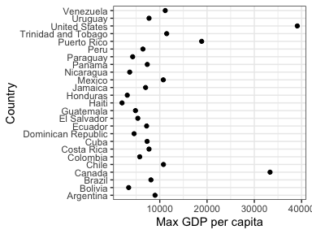
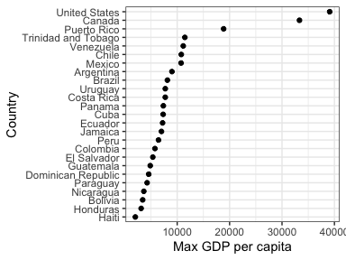
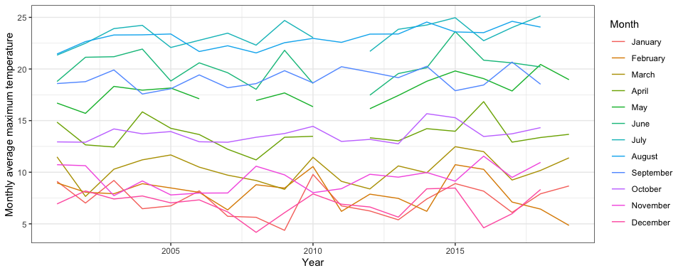
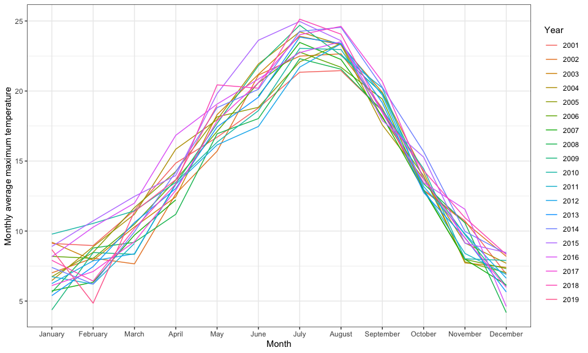
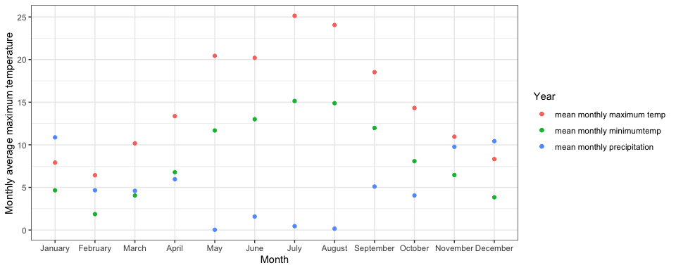
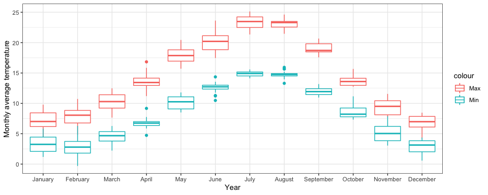

# Exercise 1: Explain the value of the here::here package 


The here::here package is useful for multiple reasons. Often people have different operating systems on their computers which can cause problems when setting file paths. For example, Windows uses a backslash ( \ ) where MacOS uses a forwardslash (/). 
For example, my current working directory is: "Users/Eve/courses/STAT_545/STAT545-participation" but this wouldn't be the same on a Windows computer. 

Here::here is also useful because it makes it easier to use subdirectories. Once can set the subdirectory to run code from without being in that directory. 


#Exercise 2: Factor management
Task: Choose one dataset (of your choice) and a variable to explore. After ensuring the variable(s) you’re exploring are indeed factors, you should:

## Drop Oceania
First print the gapminder dataset to see which columns are factors:

```r
gapminder
```

```
## # A tibble: 1,704 x 6
##    country     continent  year lifeExp      pop gdpPercap
##    <fct>       <fct>     <int>   <dbl>    <int>     <dbl>
##  1 Afghanistan Asia       1952    28.8  8425333      779.
##  2 Afghanistan Asia       1957    30.3  9240934      821.
##  3 Afghanistan Asia       1962    32.0 10267083      853.
##  4 Afghanistan Asia       1967    34.0 11537966      836.
##  5 Afghanistan Asia       1972    36.1 13079460      740.
##  6 Afghanistan Asia       1977    38.4 14880372      786.
##  7 Afghanistan Asia       1982    39.9 12881816      978.
##  8 Afghanistan Asia       1987    40.8 13867957      852.
##  9 Afghanistan Asia       1992    41.7 16317921      649.
## 10 Afghanistan Asia       1997    41.8 22227415      635.
## # … with 1,694 more rows
```
From this I can see that "country" and "continent" are factors. 

I'm going to consider the "continent" factors and I want to drop all data that's associated with Oceania.

We can look at the initial number of continent factors:

```r
gapminder$continent %>% 
  nlevels() 
```

```
## [1] 5
```
So we see we have 5 continent factors. 
We can also check how many rows are in our initial `gapminder` dataset, and we see we have 1704 rows. 

```r
nrow(gapminder)
```

```
## [1] 1704
```


Then we can create a new dataset (`gconts_dropped`) with all continents except Oceania. And then use `droplevels()` to make sure the unused levels are dropped. 

```r
(gconts_dropped <- gapminder %>% 
  filter(continent == c("Asia", "Europe", "Americas", "Africa")) %>% # choose only certain factors (all except Oceania)
  droplevels()) # drop the unused factors
```

```
## # A tibble: 420 x 6
##    country     continent  year lifeExp      pop gdpPercap
##    <fct>       <fct>     <int>   <dbl>    <int>     <dbl>
##  1 Afghanistan Asia       1952    28.8  8425333      779.
##  2 Afghanistan Asia       1972    36.1 13079460      740.
##  3 Afghanistan Asia       1992    41.7 16317921      649.
##  4 Albania     Europe     1957    59.3  1476505     1942.
##  5 Albania     Europe     1977    68.9  2509048     3533.
##  6 Albania     Europe     1997    73.0  3428038     3193.
##  7 Algeria     Africa     1967    51.4 12760499     3247.
##  8 Algeria     Africa     1987    65.8 23254956     5681.
##  9 Algeria     Africa     2007    72.3 33333216     6223.
## 10 Angola      Africa     1967    36.0  5247469     5523.
## # … with 410 more rows
```

Finally, we can check how many levels we have in our new `gconts_dropped` dataset, and we see that we now have 4 continent levels / factors. 

```r
gconts_dropped$continent %>% 
  nlevels()
```

```
## [1] 4
```

If we check the number of rows in our new dataset we see we have 420 rows. This means that we lost 1284 rows that belonged to data for Oceania.

```r
nrow(gconts_dropped)
```

```
## [1] 420
```

## Reorder levels

First we'll continue with our dataset without Oceania. We'll create a summary statistic for the maximum GDP per  capita for each country. 

```r
(max <- gconts_dropped %>% 
  group_by(continent, country) %>% 
  summarize(max_gdp = max(gdpPercap)))
```

```
## # A tibble: 140 x 3
## # Groups:   continent [4]
##    continent country                  max_gdp
##    <fct>     <fct>                      <dbl>
##  1 Africa    Algeria                    6223.
##  2 Africa    Angola                     5523.
##  3 Africa    Benin                      1441.
##  4 Africa    Botswana                  12570.
##  5 Africa    Burkina Faso               1217.
##  6 Africa    Burundi                     622.
##  7 Africa    Cameroon                   2603.
##  8 Africa    Central African Republic   1136.
##  9 Africa    Chad                       1704.
## 10 Africa    Comoros                    1876.
## # … with 130 more rows
```

We'll then look at the number of country levels we have and their current order. 

```r
max$country %>% 
  nlevels()
```

```
## [1] 140
```
Because it's a lot of countries we'll choose only data for the Americas. So we'll drop all the other country levels.
And then we'll only have 25 countries to work with. 

```r
(g_americas <- max %>% 
  filter(continent == "Americas") %>% # choose only certain factors (all except Oceania)
  droplevels())
```

```
## # A tibble: 25 x 3
## # Groups:   continent [1]
##    continent country            max_gdp
##    <fct>     <fct>                <dbl>
##  1 Americas  Argentina            8998.
##  2 Americas  Bolivia              3413.
##  3 Americas  Brazil               8131.
##  4 Americas  Canada              33329.
##  5 Americas  Chile               10779.
##  6 Americas  Colombia             5755.
##  7 Americas  Costa Rica           7723.
##  8 Americas  Cuba                 7317.
##  9 Americas  Dominican Republic   4564.
## 10 Americas  Ecuador              7214.
## # … with 15 more rows
```

Plot to see the current order of levels:

```r
g_americas %>%
  ggplot() +
  geom_point(aes(country, max_gdp)) +
  coord_flip() +
  theme_bw() +
  ylab("Max GDP per capita") + xlab("Country")
```


From the above plot it's easy to see that the country levels are ordered alphabetically.

But we want to change the order so the graph is easier to read. So we'll change the order for countries to be sorted from the country with the lowest GDP per capita to the highest GDP per capita. 


```r
g_americas %>%
  ggplot() +
  geom_point(aes(fct_reorder(country, max_gdp, min),max_gdp)) +
  coord_flip()+
  theme_bw() +
  ylab("Max GDP per capita") + xlab("Country")
```




# Exercise 3: File input/output (I/O) 

Task: Experiment with at least one of:

write_csv()/read_csv() (and/or TSV friends),
saveRDS()/readRDS(),
dput()/dget().
You are expected to create something new, probably by filtering or grouped-summarization of your dataset (for e.g., Singer, Gapminder, or another dataset), export it to disk and then reload it back in using one of the packages above. You should use here::here() for reading in and writing out.

With the imported data, play around with factor levels and use factors to order your data with one of your factors (i.e. non-alphabetically). For the I/O method(s) you chose, comment on whether or not your newly created file survived the round trip of writing to file then reading back in.

Set the filename and the path using here::here.

```r
filename <- "daily_alldata.csv"
path <- here::here("hw05","data", filename)
```

Read in the CSV file:

```r
(weather <- read_csv(path, skip=25))
```

```
## # A tibble: 6,939 x 27
##    Date   Year Month   Day `Data Quality` `Max Temp (deg … `Max Temp Flag`
##    <chr> <dbl> <dbl> <dbl> <lgl>                     <dbl> <chr>          
##  1 01/0…  2001     1     1 NA                         10.4 <NA>           
##  2 01/0…  2001     1     2 NA                          9.9 <NA>           
##  3 01/0…  2001     1     3 NA                         12.2 <NA>           
##  4 01/0…  2001     1     4 NA                         10.6 <NA>           
##  5 01/0…  2001     1     5 NA                         12.7 <NA>           
##  6 01/0…  2001     1     6 NA                          8.9 <NA>           
##  7 01/0…  2001     1     7 NA                          7.3 <NA>           
##  8 01/0…  2001     1     8 NA                         10.6 <NA>           
##  9 01/0…  2001     1     9 NA                         10.4 <NA>           
## 10 01/0…  2001     1    10 NA                         10.9 <NA>           
## # … with 6,929 more rows, and 20 more variables: `Min Temp (Deg C)` <dbl>,
## #   `Min Temp Flag` <chr>, `Mean Temp (Deg C)` <dbl>, `Mean Temp
## #   Flag` <chr>, `Heat Deg Days (C)` <dbl>, `Heat Deg Days Flag` <chr>,
## #   `Cool Deg Days (C)` <dbl>, `Cool Deg Days Flag` <chr>, `Total Rain
## #   (mm)` <lgl>, `Total Rain Flag` <lgl>, `Total Snow (cm)` <lgl>, `Total
## #   Snow Flag` <lgl>, `Total Precip (mm)` <dbl>, `Total Precip
## #   Flag` <chr>, `Snow on Grnd (cm)` <lgl>, `Snow on Grnd Flag` <lgl>,
## #   `Dir of Max Gust (10s deg)` <lgl>, `Dir of Max Gust Flag` <lgl>, `Spd
## #   of Max Gust (km/h)` <lgl>, `Spd of Max Gust Flag` <lgl>
```

We can convert the values in `Date` to actual dates using `lubridate`.

```r
weather$Date <- with(weather, lubridate::ymd(Date))
```

The data is weather data for Vancouver harbour from 2001 to 2019. 
I now want to drop the coloumns that are all NAs and 

We can now use `group by()` and `summarize()` to refine our dataset and calculate the mean monthly temperature and precipitation for Vancouver Harbour. 

```r
(weather_mod <- weather %>% 
  group_by(Year, Month) %>% 
  summarize(meanMax = mean(`Max Temp (deg C)`, na.rm = TRUE),
            meanMin = mean(`Min Temp (Deg C)`, na.rm = TRUE),
            meanPcp = mean(`Total Precip (mm)`, na.rm = TRUE)))
```

```
## # A tibble: 228 x 5
## # Groups:   Year [19]
##     Year Month meanMax meanMin meanPcp
##    <dbl> <dbl>   <dbl>   <dbl>   <dbl>
##  1  2001     1    9.11    4.23    5.66
##  2  2001     2    8.96    2.80    1.3 
##  3  2001     3   11.5     5.06    5.26
##  4  2001     4   14.8     7.25    5.11
##  5  2001     5   16.7     9.47    2.81
##  6  2001     6   18.8    11.8     3.43
##  7  2001     7   21.3    14.2     0.9 
##  8  2001     8   21.5    14.6     3.68
##  9  2001     9   18.6    12.2     2.03
## 10  2001    10   12.9     7.78    6.90
## # … with 218 more rows
```


Then we can set the months as factors so that we can examine monthly patterns and make nice plots. 


```r
(weather_mod_facs <- weather_mod %>% 
  mutate(Month = factor(case_when(Month == 1 ~ "January",
                   Month == 2 ~ "February",
                   Month == 3 ~ "March",
                   Month == 4 ~ "April",
                   Month == 5 ~ "May",
                   Month == 6 ~ "June",
                   Month == 7 ~ "July",
                   Month == 8 ~ "August",
                   Month == 9 ~ "September",
                   Month == 10 ~ "October",
                   Month == 11 ~ "November",
                   Month == 12 ~ "December"),
         levels = c("January","February","March","April","May","June",
                    "July","August","September","October","November","December"))))
```

```
## # A tibble: 228 x 5
## # Groups:   Year [19]
##     Year Month     meanMax meanMin meanPcp
##    <dbl> <fct>       <dbl>   <dbl>   <dbl>
##  1  2001 January      9.11    4.23    5.66
##  2  2001 February     8.96    2.80    1.3 
##  3  2001 March       11.5     5.06    5.26
##  4  2001 April       14.8     7.25    5.11
##  5  2001 May         16.7     9.47    2.81
##  6  2001 June        18.8    11.8     3.43
##  7  2001 July        21.3    14.2     0.9 
##  8  2001 August      21.5    14.6     3.68
##  9  2001 September   18.6    12.2     2.03
## 10  2001 October     12.9     7.78    6.90
## # … with 218 more rows
```

Then maybe we just want to look at 2018 data:

```r
(weather2018 <- weather_mod_facs %>% 
  filter(Year == 2018))
```

```
## # A tibble: 12 x 5
## # Groups:   Year [1]
##     Year Month     meanMax meanMin meanPcp
##    <dbl> <fct>       <dbl>   <dbl>   <dbl>
##  1  2018 January      7.91    4.66 10.9   
##  2  2018 February     6.43    1.87  4.67  
##  3  2018 March       10.2     4.05  4.60  
##  4  2018 April       13.4     6.78  5.96  
##  5  2018 May         20.4    11.7   0.0290
##  6  2018 June        20.2    13     1.58  
##  7  2018 July        25.1    15.1   0.455 
##  8  2018 August      24.1    14.9   0.161 
##  9  2018 September   18.5    12.0   5.1   
## 10  2018 October     14.3     8.08  4.05  
## 11  2018 November    11.0     6.45  9.76  
## 12  2018 December     8.33    3.84 10.4
```


Now we can write our modified data out and then read it back in... 

```r
filename2018 <- "weather2018.csv"
filename_edits <- "weather_edits.csv"

path2018 <- here::here("hw05","data", filename2018)
path_edits <- here::here("hw05","data", filename_edits)

write_csv(weather2018, path = path2018)
write_csv(weather_mod_facs, path = path_edits)
```

Now read the data back in and make plots:

```r
new_weather_edits <- read_csv(here::here("hw05","data", filename_edits))
new_weather2018 <- read_csv(here::here("hw05","data", filename2018))
```

When reading the data back in the factors are lost for our `month` variable. So we need to change month to a factor again. Other than that the data survived being saved to a file and read back in! So that's great because now I have a summarized dataset :)

```r
(new_weather_edits1 <- new_weather_edits %>% 
  mutate(Month = factor(Month,
                        levels = c("January","February","March","April","May","June",
                                   "July","August","September","October","November","December"))))
```

```
## # A tibble: 228 x 5
##     Year Month     meanMax meanMin meanPcp
##    <dbl> <fct>       <dbl>   <dbl>   <dbl>
##  1  2001 January      9.11    4.23    5.66
##  2  2001 February     8.96    2.80    1.3 
##  3  2001 March       11.5     5.06    5.26
##  4  2001 April       14.8     7.25    5.11
##  5  2001 May         16.7     9.47    2.81
##  6  2001 June        18.8    11.8     3.43
##  7  2001 July        21.3    14.2     0.9 
##  8  2001 August      21.5    14.6     3.68
##  9  2001 September   18.6    12.2     2.03
## 10  2001 October     12.9     7.78    6.90
## # … with 218 more rows
```


```r
(new_weather2018_1 <- new_weather2018 %>% 
  mutate(Month = factor(Month,
                        levels = c("January","February","March","April","May","June",
                                   "July","August","September","October","November","December"))))
```

```
## # A tibble: 12 x 5
##     Year Month     meanMax meanMin meanPcp
##    <dbl> <fct>       <dbl>   <dbl>   <dbl>
##  1  2018 January      7.91    4.66 10.9   
##  2  2018 February     6.43    1.87  4.67  
##  3  2018 March       10.2     4.05  4.60  
##  4  2018 April       13.4     6.78  5.96  
##  5  2018 May         20.4    11.7   0.0290
##  6  2018 June        20.2    13     1.58  
##  7  2018 July        25.1    15.1   0.455 
##  8  2018 August      24.1    14.9   0.161 
##  9  2018 September   18.5    12.0   5.1   
## 10  2018 October     14.3     8.08  4.05  
## 11  2018 November    11.0     6.45  9.76  
## 12  2018 December     8.33    3.84 10.4
```

Now we can plot monthly average max temp for each month over the years. 

```r
new_weather_edits1 %>% 
  ggplot(aes(Year, meanMax)) + 
  geom_line(aes(group = Month, color = Month)) +
  labs(y = "Monthly average maximum temperature", x= "Year") +
  theme_bw()
```



And then monthly average max temp for each year.

```r
new_weather_edits1 %>% 
  ggplot(aes(Month, meanMax)) + 
  geom_line(aes(group = Year, color = factor(Year))) +
  labs(y = "Monthly average maximum temperature", x= "Month", colour = "Year") +
  theme_bw()
```




And for just 2018:

```r
new_weather2018_1 %>% 
  ggplot() + 
  geom_point(aes(Month, meanMax, colour="mean monthly maximum temp")) +
  geom_point(aes(Month, meanMin, colour = "mean monthly minimumtemp")) +
  geom_point(aes(Month, meanPcp, colour = "mean monthly precipitation")) +
  labs(y = "Monthly average maximum temperature", x= "Month", colour = "Year") +
  theme_bw()
```




```r
new_weather_edits1 %>% 
  ggplot() + 
  geom_boxplot(aes(Month, meanMax, group = Month, colour = "Max")) +
  geom_boxplot(aes(Month, meanMin, group = Month, colour = "Min")) +
  labs(y = "Monthly average temperature", x= "Year") +
  theme_bw()
```




# Exercise 4: Visualization design 

Go back through your previous assignments and class participation activities and find figures you created prior to the last week of the course. Recreate at least one figure in light of something you learned in the recent class meetings about visualization design and color.

Task: Create a side-by-side plot and juxtapose your first attempt (show the original figure as-is) with a revised attempt after some time spent working on it and implementing principles of effective plotting principles. Comment and reflect on the differences.

Here on the left I'm plotting an old plot of mine from home work assignment 2. On the right I've redone the plit using the principles of effective plotting. 

Below you can see the code I'm using but I will show the plots in the next section where I save the plots to a file and then load them back in and display them. 

```r
plot1 <- gapminder %>% 
  filter(country =="Canada") %>%
  ggplot(aes(gdpPercap, lifeExp)) +
    geom_point() +
    xlab("GDP per capita") +
    ylab("Life expectancy") +
    ggtitle("Life expectancy vs. GDP per capita in Canada")+
    scale_x_log10()


plot2 <- gapminder %>% 
  filter(country =="Canada") %>%
  ggplot(aes(gdpPercap, lifeExp)) +
    geom_point() +
    xlab("GDP per capita") +
    ylab("Life expectancy") +
    ggtitle("Life expectancy vs. GDP per capita in Canada")+
    scale_x_log10(breaks = c(10000, 20000, 30000), labels=scales::dollar)+
  theme_bw()+
  theme(panel.border = element_blank(), 
        panel.grid.major = element_blank(),
        panel.grid.minor = element_blank(),
        axis.line = element_line(colour = "black"))
  


lf_vs_gdp <- plot_grid(plot1, plot2) 
```

And lets try improving another plot that's not a line plot:
(Once again the plot will be visible in the next section)

```r
plot3 <- ggplot(gapminder, aes(continent)) +
  geom_bar()+
  ylab("Count")+
  xlab("Continent")
  
plot4 <- ggplot(gapminder, aes(continent)) +
  geom_bar(fill = "grey80")+
  ylab("")+
  xlab("")+
  ggtitle("Count of continents in gapminder data")+
  geom_text(aes(label=..count..),stat="count",position=position_stack(1))+
  theme_bw()+
  theme(panel.border = element_blank(), 
        panel.grid.major = element_blank(),
        panel.grid.minor = element_blank(),
        axis.ticks = element_blank(),
        axis.text.y = element_blank())


count_conts <- plot_grid(plot3, plot4) 
```


# Exercise 5: Writing figures to file 

Plots to save:

```r
#file name
fn1 <- "count_conts.png"
fn2 <- "lf_vs_gdp.png"
#plot object
po1 <- count_conts
po2 <- lf_vs_gdp
#path
plot_path<- here::here("hw05","plots")

ggsave(fn1, po1, device = "png", path = plot_path, width = 10, height = 4)
ggsave(fn2, po2, device = "png", path = plot_path, width = 10, height = 4)
```

This is the first plot from above that's a line plot:


And then the bar plot:


And that's a wrap!
